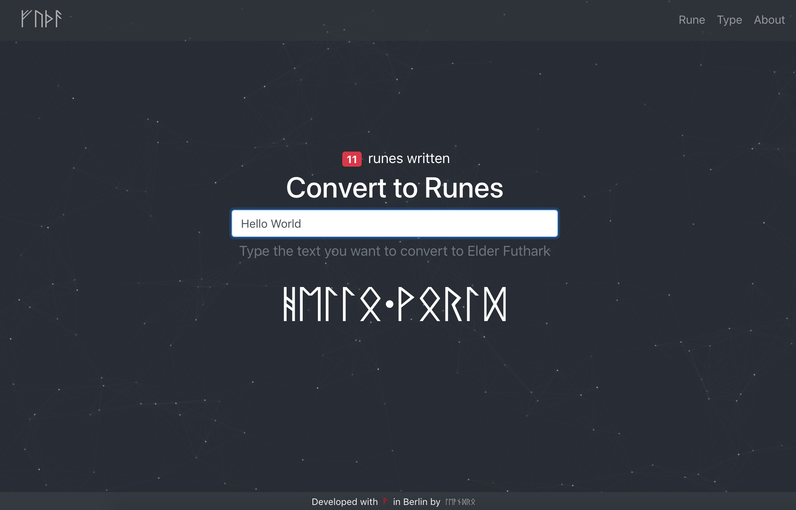

# ᚠᚢᚦᚨ (Futha)

The Elder Futhark, Elder Fuþark, Older Futhark, Old Futhark or Germanic Futhark is the oldest form of the runic alphabets. It was a writing system used by Germanic tribes for Northwest Germanic dialects in the Migration Period, the dates of which are debated among scholars. Runic inscriptions are found on artifacts, including jewelry, amulets, plateware, tools, weapons, and, famously, runestones, from the 2nd to the 8th centuries. [[Wikipedia](https://en.wikipedia.org/wiki/Elder_Futhark)]

## About
This project was strongly inspired by the work done by [Wardruna](http://www.wardruna.com) - Einar Selvik and Lindy Fay Hella - and [Heilung](https://heilung.bandcamp.com/) - Kai Uwe Faust, Maria Franz and Christopher Juul.

Wardruna is a Norwegian music group formed in 2003\. They are dedicated to creating musical renditions of Norse cultural and make significant use of Nordic historical and traditional instruments.

Heilung is amplified history from early medieval northern Europe and should not be mistaken for a modern political or religious statement of any kind. Heilung is sounds from the northern european iron age and viking period.

## Credits

ᚠᚢᚦᚨ (Futha) was developed with ᚹ in Berlin by [Leandro](https://leandro.berlin) using [React](https://reactjs.org/), [Bootstrap 5](https://getbootstrap.com/), [React Particles](https://github.com/Wufe/react-particles-js) and the Futha module. The source code is published on Github.

## Screenshot

